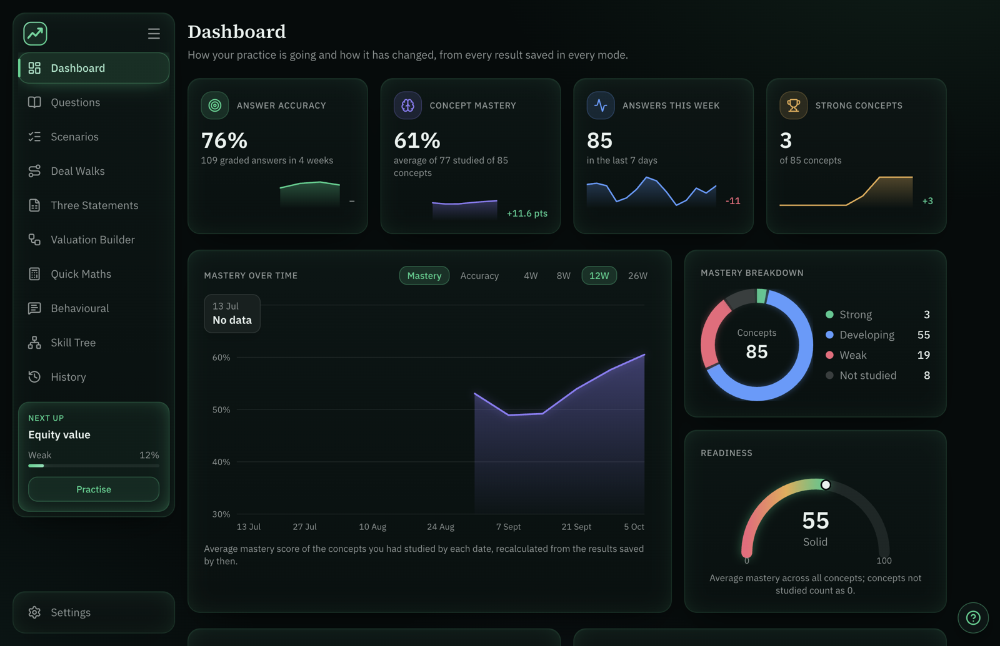
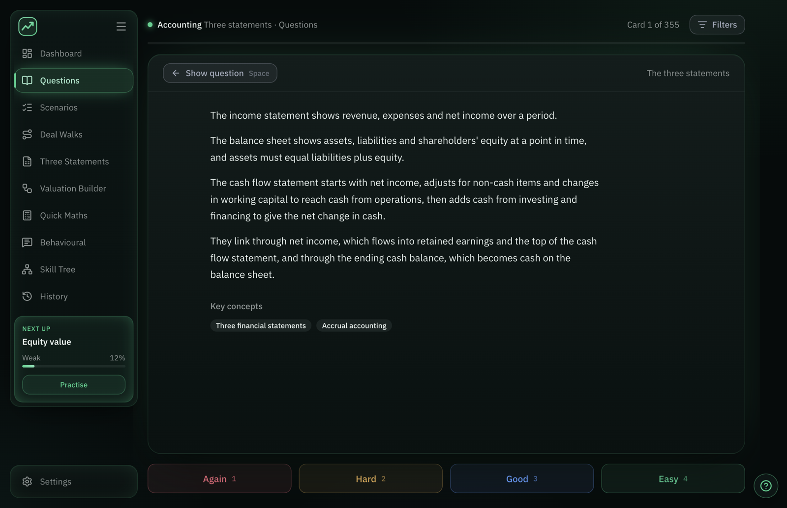
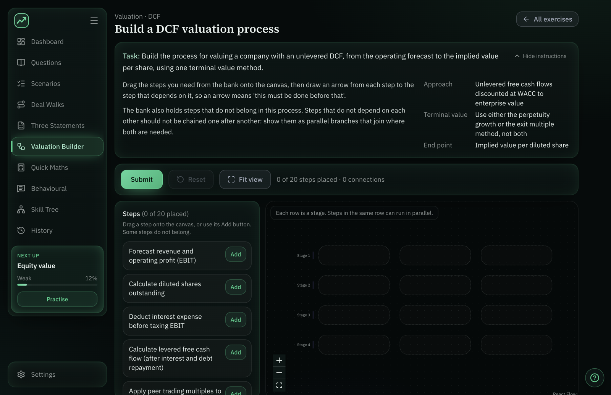
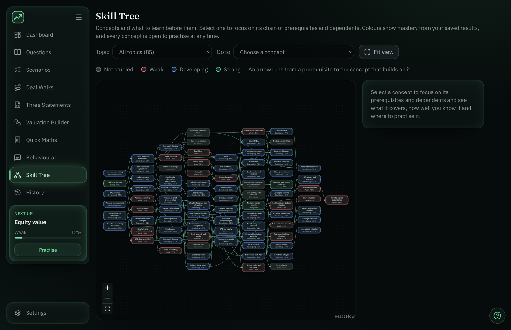

# IB Prep

**Offline investment-banking interview preparation for macOS.** Flashcards, deal walks, three-statement and valuation exercises, mental maths and behavioural practice, with a mastery dashboard that shows what to practise next. No account, no server and no AI at runtime: everything runs and stays on your Mac.

## Download

**[Download IB Prep 0.1.0 for Apple Silicon (DMG)](https://github.com/RoamingWizards/IB_Prep/releases/download/v0.1.0/IB-Prep-0.1.0-arm64.dmg)** · [Release notes](https://github.com/RoamingWizards/IB_Prep/releases/tag/v0.1.0)

Requires an Apple Silicon Mac (M1 or later) on macOS 13 or newer. Intel Macs are not supported by this build. The repository is currently private, so the link only works while signed in to GitHub with access to it.



*Screenshots show the packaged app with generated sample progress, not real study history.*

## Install

1. Open the DMG and drag **IB Prep** onto the **Applications** shortcut.
2. This release is **not signed or notarised** (see [Status](#status-and-limitations)), so macOS will warn on first launch. Right-click **IB Prep** in Applications, choose **Open**, then **Open** again. If macOS still blocks it, allow it under System Settings → Privacy & Security.
3. After that it opens like any other app and works offline.

## What is in it

The app opens on the Dashboard. The menu on the left switches between modes.

| Mode | What it is for |
| --- | --- |
| **Dashboard** | Shows how practice is going: answer accuracy, concept mastery, answers this week, strong concepts, mastery over time, a mastery breakdown, a readiness gauge and a "Next up" concept to practise. |
| **Questions** | Technical interview questions as flashcards. Flip the card, then rate yourself Again, Hard, Good or Easy; a simple spaced-repetition schedule decides what returns. Filter by category, subcategory and mastery, and pick a session size. |
| **Scenarios** | The same flashcard flow for longer scenario prompts. |
| **Deal Walks** | Learn the order of a deal: pick a process (M&A sell-side, IPO and more) and answer one multiple-choice question per stage. Answers are checked and saved; unfinished walks resume. |
| **Three Statements** | Edit the income statement, cash flow statement and balance sheet to show how an event flows through all three. Graded against prepared answers, with a step-by-step solution. There is no accounting engine: exercises come entirely from the content files. |
| **Valuation Builder** | Build a valuation process (for example a DCF) by placing steps from a bank, which includes steps that do not belong, and connecting them in order. Graded on the relationships you draw. |
| **Quick Maths** | Mental maths for interviews: arithmetic, percentages, fractions, multiples and enterprise-value bridges, generated locally, plus hand-written finance questions. Untimed or timed, in sets of 5, 10 or 20. |
| **Behavioural** | Write and rehearse answers. Provided questions and your own, answer frameworks and checklists, autosaved answers and bullets, a practice timer and Needs work / Ready ratings with reflections. You can export your answers. |
| **Skill Tree** | A map of concepts coloured by mastery, with authored prerequisite links, so you can see what to learn first. Mastery never locks a concept. |
| **History** | Sessions and results for every mode: flashcard sessions and attempts, Deal Walk and multiple-choice results, Three Statements, Valuation Builder and Quick Maths attempts, and Behavioural practice. |

### Mastery

One documented calculation turns saved results from every mode into a level for each concept: Not studied, Weak, Developing or Strong. Self-rated flashcard evidence counts for less than answers the app graded itself, newer results count for more, and a concept needs graded evidence to reach Strong. Details and constants are in [docs/MASTERY.md](docs/MASTERY.md). Mastery does not change the flashcard schedule.







## Content

The app ships with a full content bank, bundled so a fresh install is ready to use: 355 questions, 43 scenarios, 85 concepts, 84 multiple-choice questions in 14 deal processes, 37 three-statement exercises, 13 valuation exercises, 73 authored quick-maths questions and 63 behavioural questions. The same bank is published with each release as `ib400-complete.json`.

Content is plain JSON in a documented format ([docs/CONTENT_SCHEMA.md](docs/CONTENT_SCHEMA.md), with an [example pack](docs/example-content-pack.json)).

- **Import:** Settings → Content → Import pack. The file is validated first and you see a preview of what will be added or updated. Import only adds or updates items by their stable ID. It never deletes anything and never touches your progress. Imported content is stored separately from progress.
- **Export:** Settings → Content → Export content bank saves everything the app currently holds as a pack.
- **Check a pack from the command line:** `npm run validate-content -- pack.json`.
- The **?** button (bottom right) copies instructions you can paste into a chat assistant of your choice to help prepare a pack. The app itself never contacts an AI service.

## Keyboard shortcuts and appearance

- **Keybinds** (Settings → Keybinds): every shortcut can be rebound and the choice is saved. Defaults: Space flips a card, 1–4 rate it, Esc collapses the menu; in Deal Walks A–E choose an option and Enter submits or continues; in Behavioural practice N shows or hides your notes, L the checklist and T starts or stops the timer. Shortcuts do not fire while you type in a field, and combinations reserved by macOS or the browser are refused rather than promised.
- **Appearance** (Settings → Appearance): six presets (Emerald, Midnight blue, Violet, Amber, Graphite, Light) or your own background, panel, accent and text colours.

## Your data, backups and privacy

Everything is stored on your Mac, in the app's own storage (`~/Library/Application Support/IB Prep`) as two databases, one for progress and one for imported content, plus a small copy of your theme colours and a file remembering the window position. Nothing is sent anywhere: the desktop app blocks every network request except its own bundled files, and only the React Flow credit link opens in your browser if you click it. Replacing the app with a newer version keeps your data; deleting the app does not delete it.

**Settings → Privacy & Data** lets you:

- **Download a backup:** one JSON file with content, progress, History, unfinished drafts, Behavioural answers and settings. Backups are not encrypted.
- **Restore a backup:** the file is checked completely first, you see what will be replaced, and you confirm. If a restore fails, your existing data is kept. This is also how to move data from the browser version to the app.
- **Delete** study history, Behavioural answers or all app data, each with an explanation of what it removes and a confirmation.

Read the full details in [docs/PRIVACY_AND_DATA.md](docs/PRIVACY_AND_DATA.md). The notice inside the app is a draft: publisher and contact details are marked as missing, and it makes no legal-compliance claims.

## Status and limitations

- **Version 0.1.0, first release.** Apple Silicon only; no Intel or universal build.
- **Unsigned and not notarised.** The build is ad-hoc signed only. Developer ID signing and Apple notarisation are outstanding for a wider public release; until then macOS shows the warning described under Install.
- No automatic updates: install a newer DMG over the old app.
- Native menus and file dialogs follow macOS standards but were not scripted-tested; import, export and backup were verified through the app's own flows.
- Pressing a grade key while the next card is still animating in can be ignored.
- Behavioural answers and ratings are self-assessed; there is no recording, transcription or automated grading of spoken answers.
- The Privacy notice is a draft pending publisher details.

## Development

React, TypeScript, Vite, Tailwind v4 and shadcn/ui; progress in IndexedDB via `idb`; Electron and electron-builder for the Mac app. Developed on Node 24.

```bash
npm install
npm run dev                  # browser dev server
npm run build                # typecheck and production build to dist/
npm run lint
npm run validate-content -- content-packs/ib400-complete.json
npm run electron:dev         # build, then run in Electron
npm run electron:dist        # unsigned arm64 .app and DMG in release/
```

Packaging details are in [docs/PACKAGING.md](docs/PACKAGING.md); the current state of every feature is in [PROJECT_STATUS.md](PROJECT_STATUS.md). The `release/` folder is not committed.
